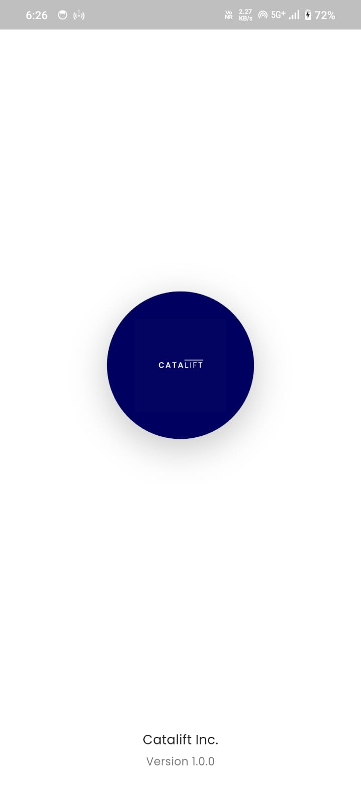
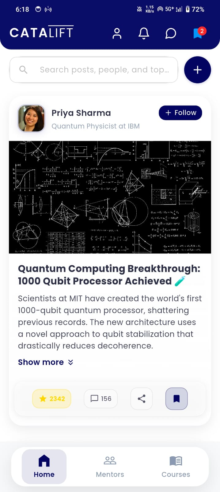
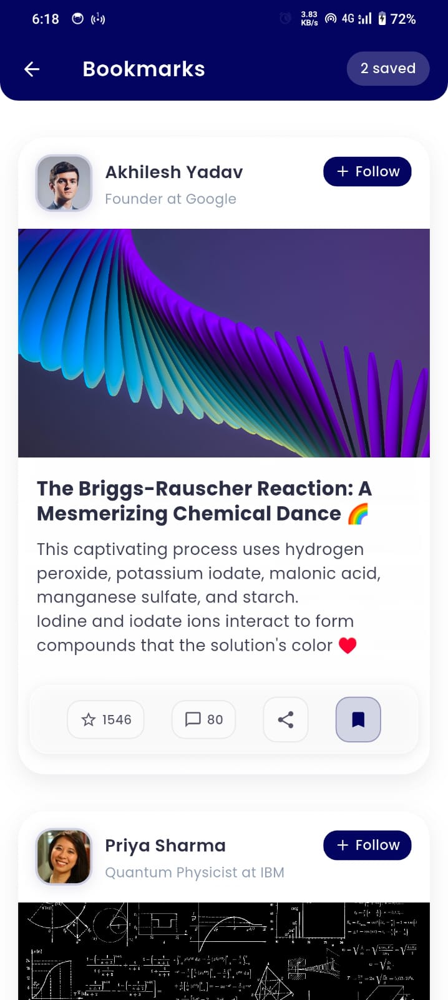
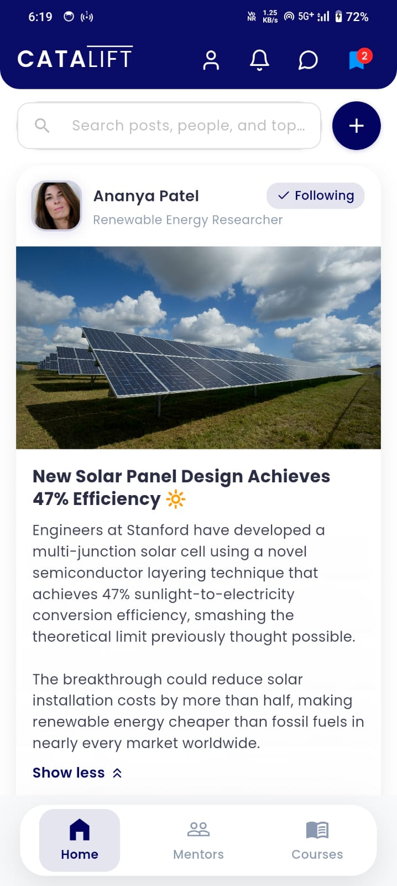
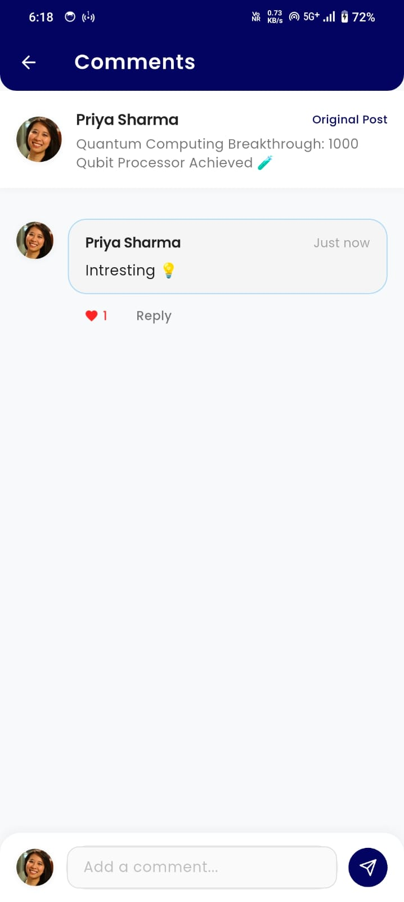

# 🚀 Catalift Assignment by Shreyash

I've made several UI enhancements to the CataLift app to create a modern and user-friendly experience:

---

## ✨ UI Modernization

- Added blue gradient color scheme throughout the app  
- Implemented subtle shadows and elevation effects  
- Created rounded corners for cards and containers  

---

## 🧾 Post Card Improvements

- “Show More/Less” functionality for long posts  
- Interactive buttons (Like, Comment, Share, Save) with proper visual feedback  
- Fill animations for Bookmark and Star buttons  
- Material Design icons used for consistency  

---

## 💬 Comment System Enhancements

- Dynamic comment count updates  
- Nested comments and reply system  
- Sync between Home and Bookmarks screen  

---

## 🔍 Search Experience

- Minimal, clean search bar design  
- Removed excess animations  
- Added clear button for better UX  

---

## 📚 Navigation & Bookmarks

- Bookmark with visual feedback  
- Bookmarked post counter  
- Smooth transitions between screens  

---

## 📸 Screenshots

| Splash Screen| Home Screen | Bookmark Screen | Post Expanded | Comments | Search Screen |
|-------------|----------------|-----------|------------|------------|------------|
|  |  |  |  |  |  |

## 📦 APK (Download and Try)

👉 [Click here to download the APK](apk/catalift_app.apk)

## 🔧 Tech Stack

- Flutter (Dart)  
- State management: `setState`  
- Clean architecture  
- Responsive UI  

---

## 💡 Final Notes

These improvements have transformed the app into a more modern, visually appealing, and user-friendly experience while maintaining good performance.
